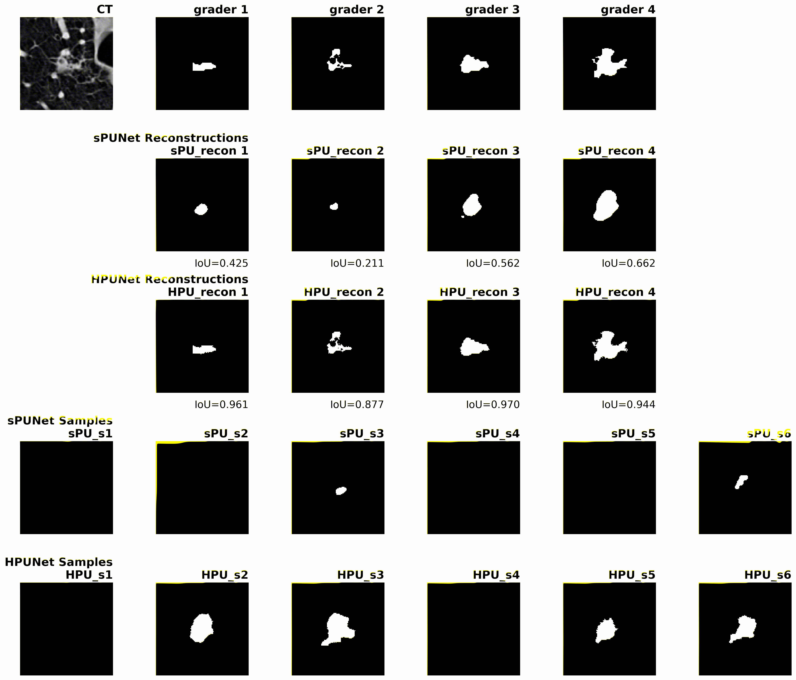

# HPU-Net Reproduction

This project reproduces Figure 2 from the [Hierarchical Probabilistic U-Net](https://arxiv.org/abs/1905.13077) paper, which compares the performance of [sPU-Net](https://arxiv.org/abs/1806.05034) and HPU-Net models on medical image segmentation with uncertainty modeling. The reproduction uses the LIDC-IDRI lung lesion dataset, available from Kohl et al. at this [Google Cloud Storage bucket](https://console.cloud.google.com/storage/browser/hpunet-data/lidc_crops/).


## Setup

```bash
conda create -n hpu python=3.12
conda activate hpu
pip install -r requirements.txt
export PYTHONPATH="$PROJECT_DIR/src:${PYTHONPATH:-}"
```

## Data Preparation

Build CSV manifests:
```bash
python src/scripts/build_manifests.py \
  --data-root /path/to/lidc_crops \
  --out /path/to/lidc_crops \
  --project-root /path/to/project \
  --splits train val test
```

## Training

### HPU-Net
```bash
python src/hpunet/train/train_hpu.py \
  --config configs/train_hpu_lidc.json \
  --project-root /path/to/project \
  --data-root /path/to/lidc_crops \
  --outdir /path/to/output \
  --max-steps 240000
```

### sPU-Net
```bash
python src/hpunet/train/train_spu.py \
  --config configs/train_spu_lidc.json \
  --project-root /path/to/project \
  --data-root /path/to/lidc_crops \
  --outdir /path/to/output \
  --max-steps 240000
```

## Evaluation

```bash
jupyter notebook src/hpunet/eval/spu_hpu_eval_compare.ipynb
```

## Results

Reproduction results on LIDC-IDRI dataset comparing our implementation with original paper metrics:

**Case 1 - All samples (including empty masks; sPU=1980, HPU=1980):**

| Model   | GED²                | IoUrec            | Hungarian         |
|---------|---------------------|-------------------|-------------------|
| sPU-Net | 0.444±0.376         | 0.759±0.154       | 0.466±0.234       |
|         | (paper: 0.32±0.03)  | (paper: 0.75±0.04)| (paper: 0.50±0.03)|
| HPU-Net | 0.394±0.289         | 0.949±0.070       | 0.498±0.198       |
|         | (paper: 0.27±0.01)  | (paper: 0.97±0.00)| (paper: 0.53±0.01)|

**Case 2 - Lesions only (excluding empty masks; sPU=1980, HPU=1980):**

| Model   | GED²            | IoUrec          | Hungarian       |
|---------|-----------------|-----------------|-----------------|
| sPU-Net | 1.132±0.548     | 0.561±0.267     | 0.161±0.191     |
| HPU-Net | 0.890±0.500     | 0.941±0.057     | 0.272±0.223     |

<p align="center">
    
</p>
<p align="center">
    <em>Evaluation comparison of SPUnet and HPUnet.</em>
</p>

## Acknowledgment


We thank S. A. A. Kohl et al. for their [Probabilistic U-Net](https://arxiv.org/abs/1806.05034) (Kohl et al., 2018) and [Hierarchical Probabilistic U-Net](https://arxiv.org/abs/1905.13077) (Kohl et al., 2019) papers. We acknowledge the LIDC-IDRI dataset (Armato et al., 2011; Clark et al., 2013) and thank Kohl et al. for making the preprocessed dataset publicly available through their [Google Cloud Storage bucket](https://console.cloud.google.com/storage/browser/hpunet-data/lidc_crops/).
